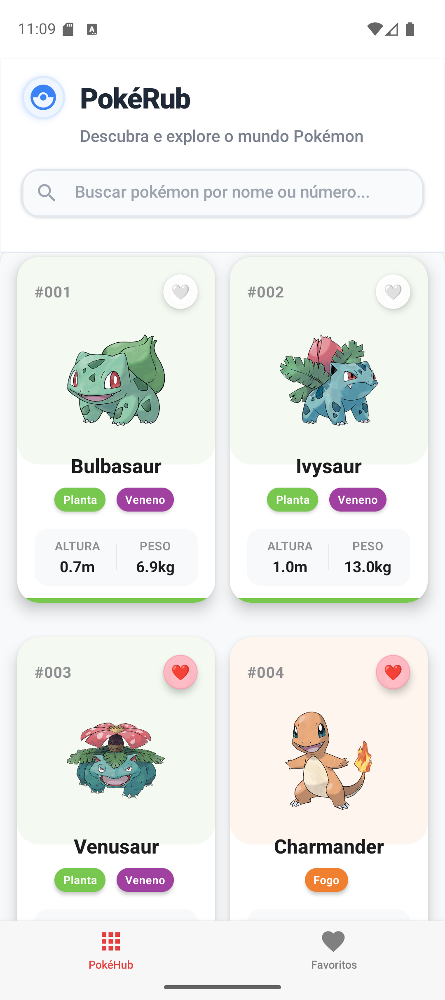
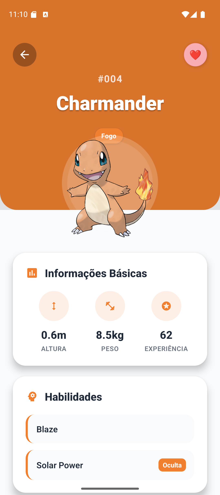
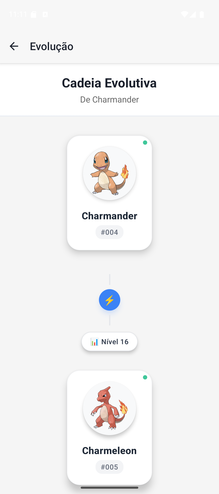
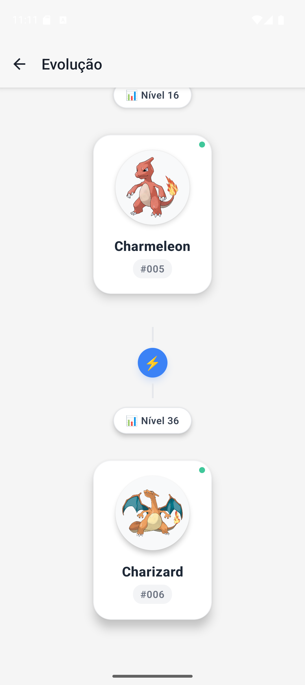
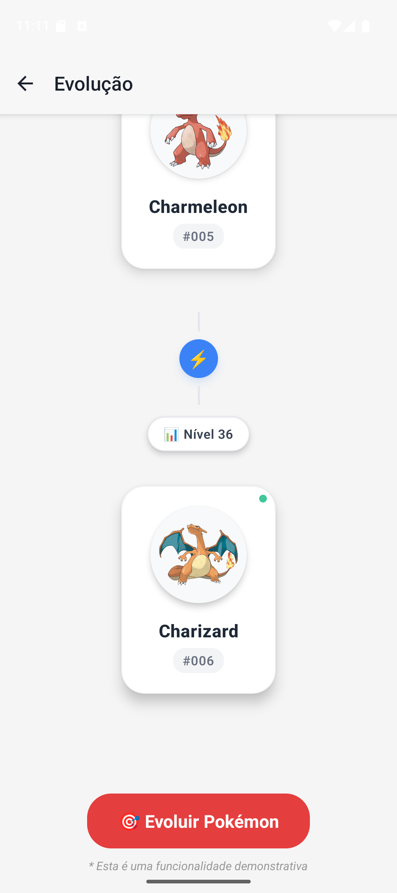
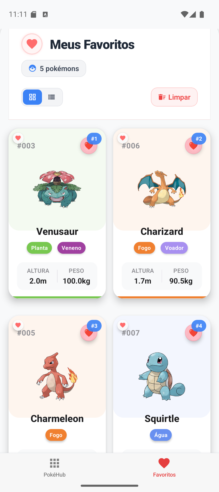
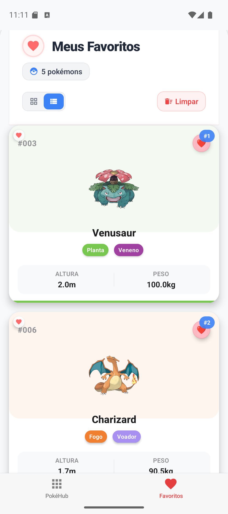
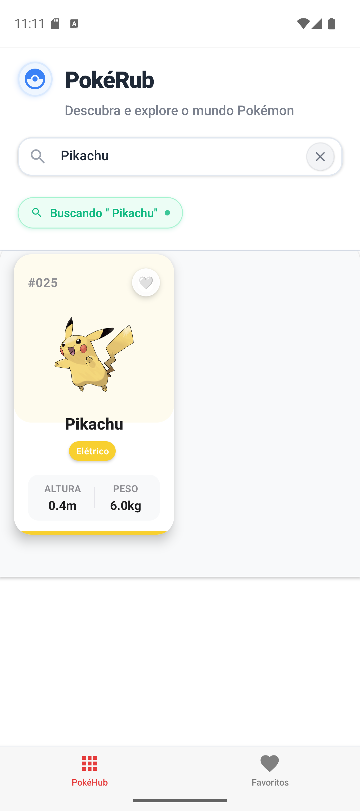

# PokéRub - Pokédex React Native

<div align="center">
  

  <h3>Uma Pokédex para teste técnico da RubPay construída com React Native</h3>


</div>

---

## 📱 Capturas de Tela

### Screenshots do Aplicativo

<div align="center">
  
  
  
  
</div>

<div align="center">
  
  
  
  
</div>

### Tela Principal - Lista de Pokémons

- Lista paginada com busca por nome/número
- Cards elegantes com informações básicas (altura, peso, tipos)
- Paginação infinita com scroll automático
- Header "PokéRub" com ícone personalizado

### Tela de Detalhes

- Design moderno com header colorido baseado no tipo do pokémon
- Informações completas: altura, peso, experiência base
- Estatísticas base com barras de progresso coloridas
- Habilidades normais e ocultas destacadas
- Botão para visualizar linha evolutiva

### Sistema de Favoritos

- Adicionar/remover pokémons dos favoritos
- Lista dedicada com contadores dinâmicos
- Modo grid/lista para visualização flexível
- Persistência local com AsyncStorage

### Cadeia Evolutiva

- Visualização completa da linha evolutiva
- Requisitos detalhados (nível, itens, condições especiais)
- Navegação entre evoluções
- Botão demonstrativo de evolução

---

## 🎯 Exercício Escolhido

**Exercício A: PokéRub** foi escolhido por representar um desafio técnico completo que abrange:
Escolhi este exercício por várias razões estratégicas:

1. **Familiaridade com Pokémon**: Como conhecedor do universo Pokémon, sabia que poderia criar uma experiência mais autêntica e detalhada
2. **API Rica e Desafiadora**: A PokeAPI oferece dados complexos que permitem demonstrar habilidades avançadas de integração
3. **Oportunidade de UX**: Pokémons são visuais por natureza, permitindo criar uma interface moderna e atrativa
4. **Complexidade Técnica Ideal**: O exercício permitia implementar desde funcionalidades básicas até features avançadas como evoluções

---

### 🔧 Desafios Enfrentados Durante o Desenvolvimento

#### 1. **PokeAPI - Complexidade Inesperada** 
**Dificuldade**: ⭐⭐⭐ (Médio)

Por mais que a PokeAPI seja rica, a documentação é muito bagunçada.
Por PokeAPI é muito mais complexa do que aparenta inicialmente:

```typescript
// Para buscar evoluções, preciso de 3 requisições encadeadas:
// 1. pokemon/{id} -> species.url
// 2. pokemon-species/{id} -> evolution_chain.url  
// 3. evolution-chain/{id} -> cadeia completa
```

**Frustrações**:
- Documentação não deixa claro as relações entre entidades
- Algumas evoluções têm condições muito específicas (horário, felicidade, localização)
- Múltiplas fontes de verdade para a mesma informação
- O Metro demora muito para fazer reload durante desenvolvimento

## 🚀 Como Executar

### Pré-requisitos

```bash
# Node.js 18+ e NPM/Yarn
node -v          # v18.x ou superior
npm -v           # v8.x ou superior

# React Native CLI
npm install -g @react-native-community/cli

# Para Android: Android Studio com SDK Platform 33
# Para iOS (macOS): Xcode 14+ e CocoaPods
```

### Instalação

```bash
# Clone o repositório
git clone <https://github.com/PedroTatibanoWorkSpace/PokeRub>
cd PokeRub

# Instale as dependências
npm install
ou
yarn android

# Para iOS (apenas macOS)
cd ios && pod install && cd ..

# Inicie o Metro Bundler
npm start
ou
yarn start

# Execute no Android
npm run android
ou
yarn android

# Execute no iOS (terminal separado - apenas macOS)
npm run ios
ou
yarn ios
```

### Comandos Úteis

```bash
# Resetar cache do Metro
npx react-native start --reset-cache

# Limpar build Android
cd android && ./gradlew clean && cd ..

# Limpar cache completo
npm cache clean --force
rm -rf node_modules && npm install
```

---

## 🏗️ Arquitetura

### Clean Architecture Implementada

```
src/
├── presentation/       # Telas, componentes e hooks
│   ├── screens/       # PokemonListScreen, PokemonDetailScreen, etc.
│   ├── components/    # PokemonCard, SearchBar, etc.
│   └── hooks/         # usePokemonList, useFavorites, etc.
├── domain/            # Modelos e interfaces
│   ├── models/        # Pokemon, Favorite, Evolution
│   └── repositories/  # Interfaces dos repositórios
├── data/              # Implementação de dados
│   ├── datasources/   # PokeApiService
│   └── repositories/  # PokemonRepository, FavoritesRepository
└── core/              # Configurações e utilitários
    ├── config/        # Navigation, QueryClient
    └── utils/         # TypesTranslations, HelpersFunctions
```

### Stack Tecnológica

- **React Native 0.72.6**: Framework principal
- **TypeScript**: Tipagem estática completa
- **React Query**: Gerenciamento de estado servidor e cache
- **React Navigation**: Navegação Stack + Tab
- **AsyncStorage**: Persistência local de favoritos
- **React Native Vector Icons**: Ícones Material Design
- **Clean Architecture**: Separação clara de responsabilidades
- **Repository Pattern**: Abstração da camada de dados

---

## 🧠 Padrões Implementados

### Repository Pattern

```ts
interface IPokemonRepository {
  getPokemonList(limit?: number, offset?: number): Promise<PokemonListResponse>;
  getPokemonById(id: number): Promise<Pokemon>;
  getPokemonByName(name: string): Promise<Pokemon>;
  searchPokemon(query: string): Promise<Pokemon[]>;
}
```

### Custom Hooks

```ts
export function usePokemonDetail(pokemonId: number) {
  return useQuery({
    queryKey: [QUERY_KEYS.POKEMON_DETAIL, pokemonId],
    queryFn: () => pokemonRepository.getPokemonById(pokemonId),
    enabled: !!pokemonId,
    staleTime: 15 * 60 * 1000,
  });
}
```

### Componentização

```tsx
<PokemonCard
  pokemon={pokemon}
  onPress={() => handlePokemonPress(item.id)}
  cardWidth={CARD_WIDTH}
/>
```

---

## 📝 Observações do Desenvolvimento

### ✅ Histórias Implementadas

**História 1: Visualização e Busca**

- ✅ Lista completa de pokémons com paginação infinita
- ✅ Busca por nome e número com debounce
- ✅ Características: tipos, altura, peso, habilidades, stats

**História 2: Sistema de Evoluções**

- ✅ Visualização da cadeia evolutiva completa
- ✅ Requisitos de evolução (nível, itens, condições)
- ✅ Funcionalidade demonstrativa de evolução

**História 3: Sistema de Favoritos**

- ✅ Adicionar/remover favoritos com persistência
- ✅ Lista dedicada com modos grid/lista
- ✅ Sincronização entre telas

### 🔧 Desafios Técnicos

- **PokeAPI Complexa**: Evoluções requerem múltiplas requisições encadeadas
- **Cache Inteligente**: Balanceamento entre performance e dados atualizados
- **Tipagem TypeScript**: Modelagem completa das respostas da API
- **Performance**: Paginação infinita sem travamentos

### 💡 Soluções Adotadas

- **React Query**: Eliminação do Redux para estado servidor
- **Lazy Loading**: Carregamento sob demanda de detalhes
- **Debounce Search**: Otimização de requisições de busca
- **Memoização**: Componentes otimizados com React.memo

---

## 🎨 Design System

### Cores Principais

- Primary: `#E53E3E` (Vermelho Pokémon)
- Success: `#10B981` (Verde)
- Info: `#3B82F6` (Azul)
- Background: `#F8FAFC` (Cinza claro)

### Componentes Principais

- **PokemonCard**: Cards com shadow e informações básicas
- **SearchBar**: Busca com animações sutis
- **TypeChip**: Chips coloridos por tipo de pokémon
- **LoadingSpinner**: Estados de carregamento consistentes

---

## 🛠️ Estrutura de Pastas

```
src/presentation/screens/
├── PokemonListScreen/
│   ├── PokemonListScreen.tsx
│   └── styles.ts
├── PokemonDetailScreen/
│   ├── PokemonDetailScreen.tsx
│   └── styles.ts
├── FavoritesScreen/
│   ├── FavoritesScreen.tsx
│   └── styles.ts
└── EvolutionScreen/
    ├── EvolutionScreen.tsx
    └── styles.ts
```

---

## 📩 Considerações Finais

### ✨ Destaques do Projeto

- **Arquitetura Limpa**: Separação clara de responsabilidades
- **Performance Otimizada**: Paginação infinita e cache inteligente
- **UX Polida**: Animações sutis e feedback visual consistente
- **Código Limpo**: TypeScript com tipagem completa
- **Escalabilidade**: Estrutura preparada para crescimento

### 🎯 Objetivos Alcançados

- ✅ Todas as 3 histórias de usuário implementadas
- ✅ Integração completa com PokeAPI
- ✅ Interface moderna e responsiva
- ✅ Sistema de favoritos persistente
- ✅ Performance otimizada para mobile

---

**Desenvolvido para o teste técnico RubCube**  
**Tempo de desenvolvimento**: menos de 48 horas  
**Status**: ✅ Completo e funcional
